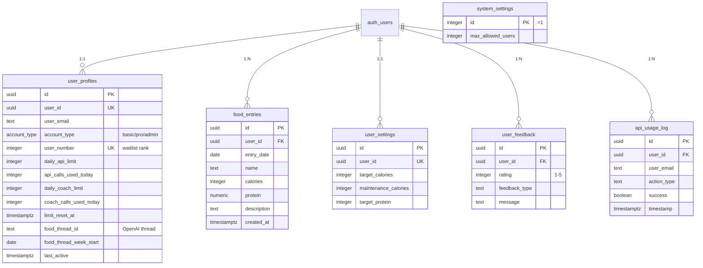

# Food Tracker Database Schema
> Complete Supabase PostgreSQL schema for the new-tracker app

**Last Updated:** March 4, 2026
**Project:** new-tracker (Expo + Next.js)
**Database:** Supabase PostgreSQL

---

## Quick Start

To replicate this database:

1. Create a new Supabase project
2. Copy the SQL files from `supabase/migrations/` directory
3. Run them in order in your Supabase SQL Editor
4. Or use the [Complete Setup SQL](#complete-setup-sql) below

---

## Table of Contents

1. [Database Overview](#database-overview)
2. [Entity Relationship Diagram](#entity-relationship-diagram)
3. [Tables Reference](#tables-reference)
4. [Functions Reference](#functions-reference)
5. [Complete Setup SQL](#complete-setup-sql)

---

## Database Overview

This database supports a food tracking app with:
- User authentication (Supabase Auth)
- Daily food logging with calories/protein tracking
- AI-powered food analysis and coaching
- Tiered rate limiting (Basic/Pro/Admin)
- Waitlist system for controlled rollout
- User feedback collection
- Admin analytics dashboard

### Statistics

| Resource | Count |
|----------|-------|
| **Tables** | 6 |
| **Functions** | 22 |
| **Enums** | 1 |
| **RLS Policies** | 15 (optimized) |

---

## Entity Relationship Diagram



---

## Tables Reference

### 1. `food_entries`
Daily food logs with nutrition data

| Column | Type | Default | Notes |
|--------|------|---------|-------|
| id | UUID | gen_random_uuid() | Primary key |
| user_id | UUID | - | FK to auth.users |
| entry_date | DATE | - | Date of food consumption |
| name | TEXT | - | Food name/description |
| calories | INTEGER | - | Calorie count |
| protein | NUMERIC(5,1) | - | Protein in grams |
| description | TEXT | NULL | Additional notes |
| created_at | TIMESTAMPTZ | NOW() | When logged (for DAU) |
| updated_at | TIMESTAMPTZ | NOW() | Auto-updated on edit |

**Indexes:**
- `(entry_date DESC)` - Fast date queries
- `(created_at DESC)` - DAU tracking
- `(user_id)` - User lookups

---

### 2. `user_settings`
Per-user nutrition targets

| Column | Type | Default | Notes |
|--------|------|---------|-------|
| id | UUID | gen_random_uuid() | Primary key |
| user_id | UUID | - | FK to auth.users (UNIQUE) |
| target_calories | INTEGER | 2000 | Daily calorie goal |
| maintenance_calories | INTEGER | 2000 | TDEE |
| target_protein | INTEGER | 150 | Daily protein goal (g) |
| created_at | TIMESTAMPTZ | NOW() | - |
| updated_at | TIMESTAMPTZ | NOW() | Auto-updated |

**Constraint:** One row per user (UNIQUE index on user_id)

---

### 3. `user_profiles`
Extended user data with tier, limits, and waitlist

| Column | Type | Default | Notes |
|--------|------|---------|-------|
| id | UUID | gen_random_uuid() | Primary key |
| user_id | UUID | - | FK to auth.users (UNIQUE) |
| user_email | TEXT | NULL | Cached for analytics |
| account_type | account_type | 'basic' | Tier enum |
| user_number | INTEGER | nextval() | Waitlist rank (UNIQUE) |
| daily_api_limit | INTEGER | 50 | Food analysis calls/day |
| api_calls_used_today | INTEGER | 0 | Current usage |
| daily_coach_limit | INTEGER | 10 | Coach calls/day |
| coach_calls_used_today | INTEGER | 0 | Current usage |
| limit_reset_at | TIMESTAMPTZ | NOW() + 1 day | Reset time |
| food_thread_id | TEXT | NULL | OpenAI thread ID |
| food_thread_week_start | DATE | NULL | Thread week start |
| last_active | TIMESTAMPTZ | NOW() | Last activity |
| created_at | TIMESTAMPTZ | NOW() | - |
| updated_at | TIMESTAMPTZ | NOW() | Auto-updated |

**Auto-created:** Trigger creates profile on user signup

**Indexes:**
- `(user_id)` - Fast lookups
- `(user_email)` - Analytics
- `(user_id, food_thread_week_start)` - Composite for thread queries

---

### 4. `user_feedback`
User feedback submissions

| Column | Type | Constraint | Notes |
|--------|------|------------|-------|
| id | UUID | PK | - |
| user_id | UUID | FK | auth.users |
| rating | INTEGER | 1-5 | Star rating |
| feedback_type | TEXT | enum-like | See below |
| message | TEXT | NOT NULL | Feedback text |
| created_at | TIMESTAMPTZ | NOW() | - |

**Feedback Types:** `feature_request`, `general_suggestion`, `bug_report`, `positive_feedback`

**Rate Limit:** Max 3 submissions per user per day

---

### 5. `api_usage_log`
API call tracking for analytics

| Column | Type | Default | Notes |
|--------|------|---------|-------|
| id | UUID | gen_random_uuid() | Primary key |
| user_id | UUID | - | FK to auth.users |
| user_email | TEXT | NULL | Cached for analytics |
| action_type | TEXT | 'food_analysis' | API type |
| success | BOOLEAN | true | Success flag |
| error_message | TEXT | NULL | Error details |
| timestamp | TIMESTAMPTZ | NOW() | When called |

**Action Types:** `food_analysis`, `coach_conversation`

**Indexes:**
- `(user_id, timestamp DESC)` - Composite for user queries
- `(timestamp DESC)` - Time-series queries
- `(user_email)` - Analytics

---

### 6. `system_settings`
Global app configuration (single row)

| Column | Type | Constraint | Notes |
|--------|------|------------|-------|
| id | INTEGER | =1 (CHECK) | Always 1 |
| max_allowed_users | INTEGER | DEFAULT 100 | Waitlist cutoff |
| updated_at | TIMESTAMPTZ | NOW() | - |

**Purpose:** Controls waitlist access. Users with `user_number <= max_allowed_users` have access.

---

## Enums

### `account_type`
User subscription tiers

```sql
CREATE TYPE account_type AS ENUM ('basic', 'pro', 'admin');
```

| Tier | API Calls/Day | Coach Calls/Day | Analytics | Admin |
|------|---------------|-----------------|-----------|-------|
| basic | 50 | 10 | Own data | No |
| pro | 500 | 25 | Own data | No |
| admin | 999,999 | 100 | All users | Yes |

---

## Functions Reference

### Key Functions (Most Used)

#### Rate Limiting

```sql
-- Check and increment food analysis limit
SELECT check_and_increment_rate_limit(auth.uid()); -- returns boolean

-- Check and increment coach limit
SELECT check_and_increment_coach_limit(auth.uid()); -- returns boolean

-- Get current rate limit status
SELECT * FROM get_rate_limit_status(auth.uid());
-- Returns: calls_used, calls_limit, coach_calls_used, coach_calls_limit, resets_at, account_type
```

#### Waitlist & Access

```sql
-- Check if user has access
SELECT check_user_access(auth.uid()); -- returns boolean

-- Get waitlist position info
SELECT get_user_position_info(auth.uid());
-- Returns: {"rank": 42, "totalUsers": 150, "maxAllowed": 100, "hasAccess": true}
```

#### Analytics (Admin Only)

```sql
-- Get summary stats
SELECT * FROM get_analytics_summary();
-- Returns: total_users, total_food_logs, total_coach_calls

-- Get daily metrics (optimized single call)
SELECT get_daily_metrics(30); -- days_back
-- Returns JSON: {dailyActiveUsers: [...], dailyFoodLogs: [...], dailyCoachCalls: [...]}

-- Get per-user metrics
SELECT * FROM get_user_metrics();
-- Returns table with user_id, email, user_rank, account_type, food_logs_count, etc.

-- Get weekly nutrition data
SELECT * FROM get_coach_analytics();
-- Returns 7-day breakdown with calories/protein per day + averages
```

#### Admin Controls

```sql
-- Update user tier
SELECT admin_update_user_tier('user-uuid', 'pro'::account_type);

-- Update waitlist limit
SELECT update_max_allowed_users(200);
```

#### Logging

```sql
-- Log API usage
SELECT log_api_usage(
  user_uuid := auth.uid(),
  action := 'food_analysis',
  was_success := true,
  error_msg := NULL,
  email := user.email
);
```

#### Helper

```sql
-- Check if current user is admin
SELECT is_admin(); -- returns boolean
```

---

## Complete Setup SQL

Run this SQL in your Supabase SQL Editor to create the entire schema:

```sql
-- ============================================
-- STEP 1: Create Enums
-- ============================================

CREATE TYPE account_type AS ENUM ('basic', 'pro', 'admin');

-- ============================================
-- STEP 2: Create Tables
-- ============================================

-- Food entries
CREATE TABLE food_entries (
  id UUID PRIMARY KEY DEFAULT gen_random_uuid(),
  user_id UUID NOT NULL REFERENCES auth.users(id) ON DELETE CASCADE,
  entry_date DATE NOT NULL,
  name TEXT NOT NULL,
  calories INTEGER NOT NULL,
  protein NUMERIC(5, 1) NOT NULL,
  description TEXT,
  created_at TIMESTAMPTZ NOT NULL DEFAULT NOW(),
  updated_at TIMESTAMPTZ NOT NULL DEFAULT NOW()
);

-- User settings
CREATE TABLE user_settings (
  id UUID PRIMARY KEY DEFAULT gen_random_uuid(),
  user_id UUID UNIQUE NOT NULL REFERENCES auth.users(id) ON DELETE CASCADE,
  target_calories INTEGER NOT NULL DEFAULT 2000,
  maintenance_calories INTEGER NOT NULL DEFAULT 2000,
  target_protein INTEGER NOT NULL DEFAULT 150,
  created_at TIMESTAMPTZ NOT NULL DEFAULT NOW(),
  updated_at TIMESTAMPTZ NOT NULL DEFAULT NOW()
);

-- User profiles
CREATE TABLE user_profiles (
  id UUID PRIMARY KEY DEFAULT gen_random_uuid(),
  user_id UUID UNIQUE NOT NULL REFERENCES auth.users(id) ON DELETE CASCADE,
  user_email TEXT,
  account_type account_type NOT NULL DEFAULT 'basic',
  user_number INTEGER UNIQUE,
  daily_api_limit INTEGER NOT NULL DEFAULT 50,
  api_calls_used_today INTEGER NOT NULL DEFAULT 0,
  daily_coach_limit INTEGER NOT NULL DEFAULT 10,
  coach_calls_used_today INTEGER NOT NULL DEFAULT 0,
  limit_reset_at TIMESTAMPTZ NOT NULL DEFAULT (NOW() + INTERVAL '1 day'),
  food_thread_id TEXT,
  food_thread_week_start DATE,
  last_active TIMESTAMPTZ DEFAULT NOW(),
  created_at TIMESTAMPTZ NOT NULL DEFAULT NOW(),
  updated_at TIMESTAMPTZ NOT NULL DEFAULT NOW()
);

-- User feedback
CREATE TABLE user_feedback (
  id UUID PRIMARY KEY DEFAULT gen_random_uuid(),
  user_id UUID NOT NULL REFERENCES auth.users(id) ON DELETE CASCADE,
  rating INTEGER NOT NULL CHECK (rating >= 1 AND rating <= 5),
  feedback_type TEXT NOT NULL CHECK (feedback_type IN ('feature_request', 'general_suggestion', 'bug_report', 'positive_feedback')),
  message TEXT NOT NULL,
  created_at TIMESTAMPTZ NOT NULL DEFAULT NOW()
);

-- API usage log
CREATE TABLE api_usage_log (
  id UUID PRIMARY KEY DEFAULT gen_random_uuid(),
  user_id UUID NOT NULL REFERENCES auth.users(id) ON DELETE CASCADE,
  user_email TEXT,
  action_type TEXT NOT NULL DEFAULT 'food_analysis',
  success BOOLEAN NOT NULL DEFAULT true,
  error_message TEXT,
  timestamp TIMESTAMPTZ NOT NULL DEFAULT NOW()
);

-- System settings
CREATE TABLE system_settings (
  id INTEGER PRIMARY KEY DEFAULT 1,
  max_allowed_users INTEGER NOT NULL DEFAULT 100,
  updated_at TIMESTAMPTZ NOT NULL DEFAULT NOW(),
  CHECK (id = 1)
);

INSERT INTO system_settings (id, max_allowed_users) VALUES (1, 100);

-- ============================================
-- STEP 3: Create Sequences
-- ============================================

CREATE SEQUENCE user_number_seq START WITH 1;

-- ============================================
-- STEP 4: Create Indexes
-- ============================================

-- food_entries
CREATE INDEX idx_food_entries_date ON food_entries(entry_date DESC);
CREATE INDEX idx_food_entries_created_at ON food_entries(created_at DESC);
CREATE INDEX idx_food_entries_user_id ON food_entries(user_id);

-- user_settings
CREATE UNIQUE INDEX idx_user_settings_user_id_unique ON user_settings(user_id);
CREATE INDEX idx_user_settings_user_id ON user_settings(user_id);

-- user_profiles
CREATE INDEX idx_user_profiles_user_id ON user_profiles(user_id);
CREATE INDEX idx_user_profiles_user_email ON user_profiles(user_email);
CREATE INDEX idx_user_profiles_food_thread ON user_profiles(user_id, food_thread_week_start);

-- user_feedback
CREATE INDEX idx_user_feedback_user_id ON user_feedback(user_id);
CREATE INDEX idx_user_feedback_created_at ON user_feedback(created_at DESC);

-- api_usage_log
CREATE INDEX idx_api_usage_log_user_id ON api_usage_log(user_id);
CREATE INDEX idx_api_usage_log_timestamp ON api_usage_log(timestamp DESC);
CREATE INDEX idx_api_usage_log_user_timestamp ON api_usage_log(user_id, timestamp DESC);
CREATE INDEX idx_api_usage_log_user_email ON api_usage_log(user_email);

-- ============================================
-- STEP 5: Enable RLS
-- ============================================

ALTER TABLE food_entries ENABLE ROW LEVEL SECURITY;
ALTER TABLE user_settings ENABLE ROW LEVEL SECURITY;
ALTER TABLE user_profiles ENABLE ROW LEVEL SECURITY;
ALTER TABLE user_feedback ENABLE ROW LEVEL SECURITY;
ALTER TABLE api_usage_log ENABLE ROW LEVEL SECURITY;
ALTER TABLE system_settings ENABLE ROW LEVEL SECURITY;

-- ============================================
-- STEP 6: Create RLS Policies (Optimized)
-- ============================================

-- food_entries policies
CREATE POLICY "Users can view their own food entries"
ON food_entries FOR SELECT TO public
USING ((select auth.uid()) = user_id);

CREATE POLICY "Users can insert their own food entries"
ON food_entries FOR INSERT TO public
WITH CHECK ((select auth.uid()) = user_id);

CREATE POLICY "Users can update their own food entries"
ON food_entries FOR UPDATE TO public
USING ((select auth.uid()) = user_id);

CREATE POLICY "Users can delete their own food entries"
ON food_entries FOR DELETE TO public
USING ((select auth.uid()) = user_id);

-- user_settings policies
CREATE POLICY "Users can view their own settings"
ON user_settings FOR SELECT TO public
USING ((select auth.uid()) = user_id);

CREATE POLICY "Users can insert their own settings"
ON user_settings FOR INSERT TO public
WITH CHECK ((select auth.uid()) = user_id);

CREATE POLICY "Users can update their own settings"
ON user_settings FOR UPDATE TO public
USING ((select auth.uid()) = user_id);

-- user_profiles policies (merged for performance)
CREATE POLICY "Users view own, admins view all"
ON user_profiles FOR SELECT TO public
USING (
  (select auth.uid()) = user_id
  OR
  EXISTS (
    SELECT 1 FROM user_profiles up
    WHERE up.user_id = (select auth.uid())
      AND up.account_type = 'admin'
  )
);

CREATE POLICY "Allow profile creation on signup"
ON user_profiles FOR INSERT TO public
WITH CHECK (true);

CREATE POLICY "Admins can update profiles"
ON user_profiles FOR UPDATE TO public
USING (
  EXISTS (
    SELECT 1 FROM user_profiles
    WHERE user_id = (select auth.uid())
    AND account_type = 'admin'
  )
);

-- user_feedback policies
CREATE POLICY "Users can view their own feedback"
ON user_feedback FOR SELECT TO public
USING ((select auth.uid()) = user_id);

CREATE POLICY "Users can insert their own feedback"
ON user_feedback FOR INSERT TO public
WITH CHECK ((select auth.uid()) = user_id);

-- api_usage_log policies (merged for performance)
CREATE POLICY "Users view own, admins view all"
ON api_usage_log FOR SELECT TO public
USING (
  (select auth.uid()) = user_id
  OR
  EXISTS (
    SELECT 1 FROM user_profiles
    WHERE user_profiles.user_id = (select auth.uid())
      AND user_profiles.account_type = 'admin'
  )
);

CREATE POLICY "System can insert api logs"
ON api_usage_log FOR INSERT TO public
WITH CHECK (true);

-- system_settings policies
CREATE POLICY "Anyone can read system settings"
ON system_settings FOR SELECT TO public
USING (true);

CREATE POLICY "Admins can update system settings"
ON system_settings FOR UPDATE TO public
USING (is_admin((select auth.uid())));

-- ============================================
-- STEP 7: Grant Permissions
-- ============================================

GRANT SELECT, INSERT, UPDATE, DELETE ON food_entries TO authenticated;
GRANT SELECT, INSERT, UPDATE, DELETE ON user_settings TO authenticated;
GRANT SELECT, INSERT, UPDATE, DELETE ON user_profiles TO authenticated;
GRANT SELECT, INSERT ON user_feedback TO authenticated;
GRANT SELECT ON api_usage_log TO authenticated;
GRANT SELECT ON system_settings TO authenticated;
GRANT UPDATE ON system_settings TO authenticated;
```

### Functions SQL (Part 1 - Core Functions)

```sql
-- ============================================
-- Helper Functions
-- ============================================

CREATE OR REPLACE FUNCTION is_admin()
RETURNS BOOLEAN AS $$
BEGIN
  RETURN EXISTS (
    SELECT 1 FROM user_profiles
    WHERE user_id = auth.uid()
    AND account_type = 'admin'
  );
END;
$$ LANGUAGE plpgsql SECURITY DEFINER;

CREATE OR REPLACE FUNCTION update_updated_at_column()
RETURNS TRIGGER AS $$
BEGIN
  NEW.updated_at = NOW();
  RETURN NEW;
END;
$$ LANGUAGE plpgsql;

-- ============================================
-- User Management Functions
-- ============================================

CREATE OR REPLACE FUNCTION get_next_user_number()
RETURNS INTEGER AS $$
BEGIN
  RETURN nextval('user_number_seq');
END;
$$ LANGUAGE plpgsql;

CREATE OR REPLACE FUNCTION assign_user_number()
RETURNS TRIGGER AS $$
BEGIN
  IF NEW.user_number IS NULL THEN
    NEW.user_number := get_next_user_number();
  END IF;
  RETURN NEW;
END;
$$ LANGUAGE plpgsql;

CREATE OR REPLACE FUNCTION create_user_profile()
RETURNS TRIGGER AS $$
BEGIN
  INSERT INTO user_profiles (user_id, account_type, daily_api_limit, daily_coach_limit, user_email)
  VALUES (NEW.id, 'basic', 50, 10, NEW.email)
  ON CONFLICT (user_id) DO UPDATE SET user_email = NEW.email;
  RETURN NEW;
END;
$$ LANGUAGE plpgsql SECURITY DEFINER;

CREATE OR REPLACE FUNCTION update_user_last_active()
RETURNS TRIGGER AS $$
BEGIN
  UPDATE user_profiles
  SET last_active = NOW()
  WHERE user_id = NEW.user_id;
  RETURN NEW;
END;
$$ LANGUAGE plpgsql;

CREATE OR REPLACE FUNCTION update_daily_limit_on_tier_change()
RETURNS TRIGGER AS $$
BEGIN
  IF NEW.account_type != OLD.account_type THEN
    NEW.daily_api_limit := CASE NEW.account_type
      WHEN 'basic' THEN 50
      WHEN 'pro' THEN 500
      WHEN 'admin' THEN 999999
    END;
    NEW.daily_coach_limit := CASE NEW.account_type
      WHEN 'basic' THEN 10
      WHEN 'pro' THEN 25
      WHEN 'admin' THEN 100
    END;
  END IF;
  RETURN NEW;
END;
$$ LANGUAGE plpgsql;

-- ============================================
-- Rate Limiting Functions
-- ============================================

CREATE OR REPLACE FUNCTION should_reset_rate_limit(user_uuid UUID)
RETURNS BOOLEAN AS $$
DECLARE
  reset_time TIMESTAMPTZ;
BEGIN
  SELECT limit_reset_at INTO reset_time
  FROM user_profiles
  WHERE user_id = user_uuid;
  RETURN (reset_time IS NULL OR NOW() >= reset_time);
END;
$$ LANGUAGE plpgsql;

CREATE OR REPLACE FUNCTION reset_rate_limit(user_uuid UUID)
RETURNS VOID AS $$
BEGIN
  UPDATE user_profiles
  SET
    api_calls_used_today = 0,
    coach_calls_used_today = 0,
    limit_reset_at = date_trunc('day', NOW() + INTERVAL '1 day'),
    updated_at = NOW()
  WHERE user_id = user_uuid;
END;
$$ LANGUAGE plpgsql;

CREATE OR REPLACE FUNCTION check_and_increment_rate_limit(user_uuid UUID)
RETURNS BOOLEAN AS $$
DECLARE
  profile_record RECORD;
  calls_remaining INTEGER;
BEGIN
  SELECT * INTO profile_record FROM user_profiles WHERE user_id = user_uuid;

  IF NOT FOUND THEN
    INSERT INTO user_profiles (user_id, account_type, daily_api_limit)
    VALUES (user_uuid, 'basic', 50)
    RETURNING * INTO profile_record;
  END IF;

  IF should_reset_rate_limit(user_uuid) THEN
    PERFORM reset_rate_limit(user_uuid);
    SELECT * INTO profile_record FROM user_profiles WHERE user_id = user_uuid;
  END IF;

  calls_remaining := profile_record.daily_api_limit - profile_record.api_calls_used_today;

  IF calls_remaining <= 0 THEN
    RETURN FALSE;
  END IF;

  UPDATE user_profiles
  SET api_calls_used_today = api_calls_used_today + 1, updated_at = NOW()
  WHERE user_id = user_uuid;

  RETURN TRUE;
END;
$$ LANGUAGE plpgsql SECURITY DEFINER;

CREATE OR REPLACE FUNCTION check_and_increment_coach_limit(user_uuid UUID)
RETURNS BOOLEAN AS $$
DECLARE
  profile_record RECORD;
  calls_remaining INTEGER;
BEGIN
  SELECT * INTO profile_record FROM user_profiles WHERE user_id = user_uuid;

  IF NOT FOUND THEN
    INSERT INTO user_profiles (user_id, account_type, daily_api_limit, daily_coach_limit)
    VALUES (user_uuid, 'basic', 50, 10)
    RETURNING * INTO profile_record;
  END IF;

  IF should_reset_rate_limit(user_uuid) THEN
    PERFORM reset_rate_limit(user_uuid);
    SELECT * INTO profile_record FROM user_profiles WHERE user_id = user_uuid;
  END IF;

  calls_remaining := profile_record.daily_coach_limit - profile_record.coach_calls_used_today;

  IF calls_remaining <= 0 THEN
    RETURN FALSE;
  END IF;

  UPDATE user_profiles
  SET coach_calls_used_today = coach_calls_used_today + 1, updated_at = NOW()
  WHERE user_id = user_uuid;

  RETURN TRUE;
END;
$$ LANGUAGE plpgsql SECURITY DEFINER;

CREATE OR REPLACE FUNCTION get_rate_limit_status(user_uuid UUID)
RETURNS TABLE (
  calls_used INTEGER,
  calls_limit INTEGER,
  coach_calls_used INTEGER,
  coach_calls_limit INTEGER,
  resets_at TIMESTAMPTZ,
  account_type TEXT
) AS $$
BEGIN
  IF should_reset_rate_limit(user_uuid) THEN
    PERFORM reset_rate_limit(user_uuid);
  END IF;

  RETURN QUERY
  SELECT
    api_calls_used_today,
    daily_api_limit,
    coach_calls_used_today,
    daily_coach_limit,
    limit_reset_at,
    user_profiles.account_type::TEXT
  FROM user_profiles
  WHERE user_id = user_uuid;
END;
$$ LANGUAGE plpgsql SECURITY DEFINER;

-- ============================================
-- Logging Functions
-- ============================================

CREATE OR REPLACE FUNCTION log_api_usage(
  user_uuid UUID,
  action TEXT DEFAULT 'food_analysis',
  was_success BOOLEAN DEFAULT TRUE,
  error_msg TEXT DEFAULT NULL,
  email TEXT DEFAULT NULL
)
RETURNS VOID AS $$
BEGIN
  INSERT INTO api_usage_log (user_id, action_type, success, error_message, user_email)
  VALUES (user_uuid, action, was_success, error_msg, email);
END;
$$ LANGUAGE plpgsql SECURITY DEFINER;

-- ============================================
-- Waitlist Functions
-- ============================================

CREATE OR REPLACE FUNCTION check_user_access(user_uuid UUID)
RETURNS BOOLEAN AS $$
DECLARE
  user_num INTEGER;
  max_users INTEGER;
BEGIN
  SELECT user_number INTO user_num FROM user_profiles WHERE user_id = user_uuid;
  SELECT max_allowed_users INTO max_users FROM system_settings WHERE id = 1;
  RETURN (user_num IS NOT NULL AND user_num <= max_users);
END;
$$ LANGUAGE plpgsql SECURITY DEFINER;

CREATE OR REPLACE FUNCTION get_user_position_info(user_uuid UUID)
RETURNS JSONB AS $$
DECLARE
  user_num INTEGER;
  max_users INTEGER;
  total_count INTEGER;
BEGIN
  SELECT user_number INTO user_num FROM user_profiles WHERE user_id = user_uuid;
  SELECT max_allowed_users INTO max_users FROM system_settings WHERE id = 1;
  SELECT COUNT(*) INTO total_count FROM user_profiles;

  RETURN jsonb_build_object(
    'rank', user_num,
    'totalUsers', total_count,
    'maxAllowed', max_users,
    'hasAccess', (user_num IS NOT NULL AND user_num <= max_users)
  );
END;
$$ LANGUAGE plpgsql SECURITY DEFINER;

CREATE OR REPLACE FUNCTION get_max_allowed_users()
RETURNS INTEGER AS $$
BEGIN
  RETURN (SELECT max_allowed_users FROM system_settings WHERE id = 1);
END;
$$ LANGUAGE plpgsql SECURITY DEFINER;

CREATE OR REPLACE FUNCTION update_max_allowed_users(max_users INTEGER)
RETURNS VOID AS $$
BEGIN
  IF NOT is_admin() THEN
    RAISE EXCEPTION 'Only admins can update max allowed users';
  END IF;

  UPDATE system_settings
  SET max_allowed_users = max_users, updated_at = NOW()
  WHERE id = 1;
END;
$$ LANGUAGE plpgsql SECURITY DEFINER;

CREATE OR REPLACE FUNCTION get_total_active_users()
RETURNS INTEGER AS $$
DECLARE
  max_users INTEGER;
BEGIN
  SELECT max_allowed_users INTO max_users FROM system_settings WHERE id = 1;
  RETURN (
    SELECT COUNT(*)
    FROM user_profiles
    WHERE user_number IS NOT NULL AND user_number <= max_users
  );
END;
$$ LANGUAGE plpgsql SECURITY DEFINER;

-- ============================================
-- Feedback Functions
-- ============================================

CREATE OR REPLACE FUNCTION check_feedback_rate_limit(user_uuid UUID)
RETURNS BOOLEAN AS $$
DECLARE
  feedback_count INTEGER;
BEGIN
  SELECT COUNT(*) INTO feedback_count
  FROM user_feedback
  WHERE user_id = user_uuid AND created_at >= CURRENT_DATE;
  RETURN feedback_count < 3;
END;
$$ LANGUAGE plpgsql SECURITY DEFINER;

CREATE OR REPLACE FUNCTION get_feedback_count_today(user_uuid UUID)
RETURNS INTEGER AS $$
DECLARE
  feedback_count INTEGER;
BEGIN
  SELECT COUNT(*) INTO feedback_count
  FROM user_feedback
  WHERE user_id = user_uuid AND created_at >= CURRENT_DATE;
  RETURN feedback_count;
END;
$$ LANGUAGE plpgsql SECURITY DEFINER;

-- ============================================
-- Admin Functions
-- ============================================

CREATE OR REPLACE FUNCTION admin_update_user_tier(
  target_user_id UUID,
  new_tier account_type
)
RETURNS VOID AS $$
BEGIN
  IF NOT is_admin() THEN
    RAISE EXCEPTION 'Only admins can update user tiers';
  END IF;

  UPDATE user_profiles
  SET account_type = new_tier
  WHERE user_id = target_user_id;
END;
$$ LANGUAGE plpgsql SECURITY DEFINER;

CREATE OR REPLACE FUNCTION update_user_tier(
  user_uuid UUID,
  new_tier account_type
)
RETURNS VOID AS $$
BEGIN
  PERFORM admin_update_user_tier(user_uuid, new_tier);
END;
$$ LANGUAGE plpgsql SECURITY DEFINER;

CREATE OR REPLACE FUNCTION update_last_active(user_uuid UUID)
RETURNS VOID AS $$
BEGIN
  UPDATE user_profiles SET last_active = NOW() WHERE user_id = user_uuid;
END;
$$ LANGUAGE plpgsql SECURITY DEFINER;
```

### Functions SQL (Part 2 - Analytics Functions)

```sql
-- ============================================
-- Analytics Functions (Admin Only)
-- ============================================

CREATE OR REPLACE FUNCTION get_total_users()
RETURNS INTEGER AS $$
BEGIN
  IF NOT is_admin() THEN
    RAISE EXCEPTION 'Access denied: Admin privileges required';
  END IF;
  RETURN (SELECT COUNT(*) FROM user_profiles);
END;
$$ LANGUAGE plpgsql SECURITY DEFINER;

CREATE OR REPLACE FUNCTION get_total_food_logs()
RETURNS INTEGER AS $$
BEGIN
  IF NOT is_admin() THEN
    RAISE EXCEPTION 'Access denied: Admin privileges required';
  END IF;
  RETURN (SELECT COUNT(*) FROM food_entries);
END;
$$ LANGUAGE plpgsql SECURITY DEFINER;

CREATE OR REPLACE FUNCTION get_total_coach_calls()
RETURNS INTEGER AS $$
BEGIN
  IF NOT is_admin() THEN
    RAISE EXCEPTION 'Access denied: Admin privileges required';
  END IF;
  RETURN (SELECT COUNT(*) FROM api_usage_log WHERE action_type = 'coach_conversation');
END;
$$ LANGUAGE plpgsql SECURITY DEFINER;

CREATE OR REPLACE FUNCTION get_analytics_summary()
RETURNS TABLE(
  total_users INTEGER,
  total_food_logs INTEGER,
  total_coach_calls INTEGER
) AS $$
BEGIN
  IF NOT is_admin() THEN
    RAISE EXCEPTION 'Access denied: Admin privileges required';
  END IF;

  RETURN QUERY
  SELECT
    (SELECT COUNT(*)::INTEGER FROM user_profiles),
    (SELECT COUNT(*)::INTEGER FROM food_entries),
    (SELECT COUNT(*)::INTEGER FROM api_usage_log WHERE action_type = 'coach_conversation');
END;
$$ LANGUAGE plpgsql SECURITY DEFINER;

CREATE OR REPLACE FUNCTION get_daily_active_users(days_back INTEGER DEFAULT 30)
RETURNS TABLE(date DATE, user_count BIGINT) AS $$
BEGIN
  IF NOT is_admin() THEN
    RAISE EXCEPTION 'Access denied: Admin privileges required';
  END IF;

  RETURN QUERY
  SELECT
    date_trunc('day', fe.created_at)::DATE as date,
    COUNT(DISTINCT fe.user_id) as user_count
  FROM food_entries fe
  WHERE fe.created_at >= CURRENT_DATE - days_back
  GROUP BY date_trunc('day', fe.created_at)
  ORDER BY date ASC;
END;
$$ LANGUAGE plpgsql SECURITY DEFINER;

CREATE OR REPLACE FUNCTION get_daily_food_logs(days_back INTEGER DEFAULT 30)
RETURNS TABLE(date DATE, log_count BIGINT) AS $$
BEGIN
  IF NOT is_admin() THEN
    RAISE EXCEPTION 'Access denied: Admin privileges required';
  END IF;

  RETURN QUERY
  SELECT
    entry_date::DATE as date,
    COUNT(*) as log_count
  FROM food_entries
  WHERE entry_date >= CURRENT_DATE - days_back
  GROUP BY entry_date
  ORDER BY entry_date ASC;
END;
$$ LANGUAGE plpgsql SECURITY DEFINER;

CREATE OR REPLACE FUNCTION get_daily_coach_calls(days_back INTEGER DEFAULT 30)
RETURNS TABLE(date DATE, call_count BIGINT) AS $$
BEGIN
  IF NOT is_admin() THEN
    RAISE EXCEPTION 'Access denied: Admin privileges required';
  END IF;

  RETURN QUERY
  SELECT
    date_trunc('day', timestamp)::DATE as date,
    COUNT(*) as call_count
  FROM api_usage_log
  WHERE action_type = 'coach_conversation'
    AND timestamp >= CURRENT_DATE - days_back
  GROUP BY date_trunc('day', timestamp)
  ORDER BY date ASC;
END;
$$ LANGUAGE plpgsql SECURITY DEFINER;

CREATE OR REPLACE FUNCTION get_daily_metrics(days_back INTEGER DEFAULT 30)
RETURNS JSONB AS $$
DECLARE
  dau_data JSONB;
  dfl_data JSONB;
  dcc_data JSONB;
BEGIN
  IF NOT is_admin() THEN
    RAISE EXCEPTION 'Access denied: Admin privileges required';
  END IF;

  SELECT COALESCE(jsonb_agg(jsonb_build_object('date', date::TEXT, 'user_count', user_count)), '[]'::jsonb)
  INTO dau_data
  FROM (
    SELECT
      date_trunc('day', fe.created_at)::DATE as date,
      COUNT(DISTINCT fe.user_id)::INTEGER as user_count
    FROM food_entries fe
    WHERE fe.created_at >= CURRENT_DATE - days_back
    GROUP BY date_trunc('day', fe.created_at)
    ORDER BY date ASC
  ) dau;

  SELECT COALESCE(jsonb_agg(jsonb_build_object('date', date::TEXT, 'log_count', log_count)), '[]'::jsonb)
  INTO dfl_data
  FROM (
    SELECT
      entry_date::DATE as date,
      COUNT(*)::INTEGER as log_count
    FROM food_entries
    WHERE entry_date >= CURRENT_DATE - days_back
    GROUP BY entry_date
    ORDER BY entry_date ASC
  ) dfl;

  SELECT COALESCE(jsonb_agg(jsonb_build_object('date', date::TEXT, 'call_count', call_count)), '[]'::jsonb)
  INTO dcc_data
  FROM (
    SELECT
      date_trunc('day', timestamp)::DATE as date,
      COUNT(*)::INTEGER as call_count
    FROM api_usage_log
    WHERE action_type = 'coach_conversation'
      AND timestamp >= CURRENT_DATE - days_back
    GROUP BY date_trunc('day', timestamp)
    ORDER BY date ASC
  ) dcc;

  RETURN jsonb_build_object(
    'dailyActiveUsers', dau_data,
    'dailyFoodLogs', dfl_data,
    'dailyCoachCalls', dcc_data
  );
END;
$$ LANGUAGE plpgsql SECURITY DEFINER;

CREATE OR REPLACE FUNCTION get_user_metrics()
RETURNS TABLE(
  user_id UUID,
  email TEXT,
  user_rank INTEGER,
  account_type TEXT,
  food_logs_count BIGINT,
  coach_calls_count BIGINT,
  total_activity BIGINT,
  last_active TIMESTAMPTZ
) AS $$
BEGIN
  IF NOT is_admin() THEN
    RAISE EXCEPTION 'Access denied: Admin privileges required';
  END IF;

  RETURN QUERY
  SELECT
    up.user_id,
    au.email,
    up.user_number as user_rank,
    up.account_type::TEXT,
    COALESCE(fe.food_count, 0) as food_logs_count,
    COALESCE(cc.coach_count, 0) as coach_calls_count,
    COALESCE(fe.food_count, 0) + COALESCE(cc.coach_count, 0) as total_activity,
    up.last_active
  FROM user_profiles up
  LEFT JOIN auth.users au ON up.user_id = au.id
  LEFT JOIN (
    SELECT user_id, COUNT(*) as food_count
    FROM food_entries
    GROUP BY user_id
  ) fe ON up.user_id = fe.user_id
  LEFT JOIN (
    SELECT user_id, COUNT(*) as coach_count
    FROM api_usage_log
    WHERE action_type = 'coach_conversation'
    GROUP BY user_id
  ) cc ON up.user_id = cc.user_id
  ORDER BY total_activity DESC, up.user_number ASC;
END;
$$ LANGUAGE plpgsql SECURITY DEFINER;

CREATE OR REPLACE FUNCTION get_coach_analytics()
RETURNS TABLE(
  user_id UUID,
  email TEXT,
  target_calories INTEGER,
  target_protein INTEGER,
  maintenance_calories INTEGER,
  d1_calories INTEGER,
  d1_protein NUMERIC,
  d2_calories INTEGER,
  d2_protein NUMERIC,
  d3_calories INTEGER,
  d3_protein NUMERIC,
  d4_calories INTEGER,
  d4_protein NUMERIC,
  d5_calories INTEGER,
  d5_protein NUMERIC,
  d6_calories INTEGER,
  d6_protein NUMERIC,
  d7_calories INTEGER,
  d7_protein NUMERIC,
  avg_calories INTEGER,
  avg_protein INTEGER,
  daily_deficit INTEGER,
  weekly_deficit INTEGER,
  days_logged INTEGER
) AS $$
DECLARE
  week_start DATE;
  today DATE;
BEGIN
  IF NOT is_admin() THEN
    RAISE EXCEPTION 'Access denied: Admin privileges required';
  END IF;

  today := CURRENT_DATE;
  week_start := DATE_TRUNC('week', today) + INTERVAL '1 day';

  RETURN QUERY
  WITH user_settings AS (
    SELECT
      up.user_id,
      au.email,
      COALESCE(us.target_calories, 2000) as target_calories,
      COALESCE(us.target_protein, 150) as target_protein,
      COALESCE(us.maintenance_calories, 2000) as maintenance_calories
    FROM user_profiles up
    LEFT JOIN auth.users au ON up.user_id = au.id
    LEFT JOIN user_settings us ON up.user_id = us.user_id
  ),
  daily_totals AS (
    SELECT
      fe.user_id,
      fe.entry_date,
      SUM(fe.calories) as total_calories,
      SUM(fe.protein) as total_protein
    FROM food_entries fe
    WHERE fe.entry_date >= week_start
      AND fe.entry_date < week_start + INTERVAL '7 days'
    GROUP BY fe.user_id, fe.entry_date
  )
  SELECT
    us.user_id,
    us.email,
    us.target_calories,
    us.target_protein,
    us.maintenance_calories,
    COALESCE((SELECT total_calories FROM daily_totals dt WHERE dt.user_id = us.user_id AND dt.entry_date = week_start), 0)::INTEGER,
    COALESCE((SELECT total_protein FROM daily_totals dt WHERE dt.user_id = us.user_id AND dt.entry_date = week_start), 0),
    COALESCE((SELECT total_calories FROM daily_totals dt WHERE dt.user_id = us.user_id AND dt.entry_date = week_start + INTERVAL '1 day'), 0)::INTEGER,
    COALESCE((SELECT total_protein FROM daily_totals dt WHERE dt.user_id = us.user_id AND dt.entry_date = week_start + INTERVAL '1 day'), 0),
    COALESCE((SELECT total_calories FROM daily_totals dt WHERE dt.user_id = us.user_id AND dt.entry_date = week_start + INTERVAL '2 days'), 0)::INTEGER,
    COALESCE((SELECT total_protein FROM daily_totals dt WHERE dt.user_id = us.user_id AND dt.entry_date = week_start + INTERVAL '2 days'), 0),
    COALESCE((SELECT total_calories FROM daily_totals dt WHERE dt.user_id = us.user_id AND dt.entry_date = week_start + INTERVAL '3 days'), 0)::INTEGER,
    COALESCE((SELECT total_protein FROM daily_totals dt WHERE dt.user_id = us.user_id AND dt.entry_date = week_start + INTERVAL '3 days'), 0),
    COALESCE((SELECT total_calories FROM daily_totals dt WHERE dt.user_id = us.user_id AND dt.entry_date = week_start + INTERVAL '4 days'), 0)::INTEGER,
    COALESCE((SELECT total_protein FROM daily_totals dt WHERE dt.user_id = us.user_id AND dt.entry_date = week_start + INTERVAL '4 days'), 0),
    COALESCE((SELECT total_calories FROM daily_totals dt WHERE dt.user_id = us.user_id AND dt.entry_date = week_start + INTERVAL '5 days'), 0)::INTEGER,
    COALESCE((SELECT total_protein FROM daily_totals dt WHERE dt.user_id = us.user_id AND dt.entry_date = week_start + INTERVAL '5 days'), 0),
    COALESCE((SELECT total_calories FROM daily_totals dt WHERE dt.user_id = us.user_id AND dt.entry_date = week_start + INTERVAL '6 days'), 0)::INTEGER,
    COALESCE((SELECT total_protein FROM daily_totals dt WHERE dt.user_id = us.user_id AND dt.entry_date = week_start + INTERVAL '6 days'), 0),
    (SELECT COALESCE(ROUND(AVG(total_calories)), 0)::INTEGER FROM daily_totals dt WHERE dt.user_id = us.user_id AND dt.entry_date < today AND dt.total_calories > 0),
    (SELECT COALESCE(ROUND(AVG(total_protein)), 0)::INTEGER FROM daily_totals dt WHERE dt.user_id = us.user_id AND dt.entry_date < today AND dt.total_calories > 0),
    (SELECT COALESCE(ROUND(AVG(total_calories)), 0)::INTEGER - us.maintenance_calories FROM daily_totals dt WHERE dt.user_id = us.user_id AND dt.entry_date < today AND dt.total_calories > 0),
    ((SELECT COALESCE(ROUND(AVG(total_calories)), 0)::INTEGER - us.maintenance_calories FROM daily_totals dt WHERE dt.user_id = us.user_id AND dt.entry_date < today AND dt.total_calories > 0) *
     (SELECT COUNT(*)::INTEGER FROM daily_totals dt WHERE dt.user_id = us.user_id AND dt.entry_date < today AND dt.total_calories > 0)),
    (SELECT COUNT(*)::INTEGER FROM daily_totals dt WHERE dt.user_id = us.user_id AND dt.total_calories > 0)
  FROM user_settings us
  ORDER BY us.email ASC;
END;
$$ LANGUAGE plpgsql SECURITY DEFINER;

-- ============================================
-- Grant Permissions
-- ============================================

GRANT EXECUTE ON ALL FUNCTIONS IN SCHEMA public TO authenticated;
```

### Triggers SQL

```sql
-- ============================================
-- Create Triggers
-- ============================================

-- Auto-create user profile on signup
DROP TRIGGER IF EXISTS on_auth_user_created ON auth.users;
CREATE TRIGGER on_auth_user_created
  AFTER INSERT ON auth.users
  FOR EACH ROW
  EXECUTE FUNCTION create_user_profile();

-- Auto-assign user number
DROP TRIGGER IF EXISTS auto_assign_user_number ON user_profiles;
CREATE TRIGGER auto_assign_user_number
  BEFORE INSERT ON user_profiles
  FOR EACH ROW
  EXECUTE FUNCTION assign_user_number();

-- Update tier limits on account type change
DROP TRIGGER IF EXISTS on_account_type_change ON user_profiles;
CREATE TRIGGER on_account_type_change
  BEFORE UPDATE OF account_type ON user_profiles
  FOR EACH ROW
  EXECUTE FUNCTION update_daily_limit_on_tier_change();

-- Auto-update updated_at timestamps
DROP TRIGGER IF EXISTS update_food_entries_updated_at ON food_entries;
CREATE TRIGGER update_food_entries_updated_at
  BEFORE UPDATE ON food_entries
  FOR EACH ROW
  EXECUTE FUNCTION update_updated_at_column();

DROP TRIGGER IF EXISTS update_user_settings_updated_at ON user_settings;
CREATE TRIGGER update_user_settings_updated_at
  BEFORE UPDATE ON user_settings
  FOR EACH ROW
  EXECUTE FUNCTION update_updated_at_column();

DROP TRIGGER IF EXISTS update_user_profiles_updated_at ON user_profiles;
CREATE TRIGGER update_user_profiles_updated_at
  BEFORE UPDATE ON user_profiles
  FOR EACH ROW
  EXECUTE FUNCTION update_updated_at_column();

-- Track last active on food entry
DROP TRIGGER IF EXISTS update_last_active_on_food_entry ON food_entries;
CREATE TRIGGER update_last_active_on_food_entry
  AFTER INSERT ON food_entries
  FOR EACH ROW
  EXECUTE FUNCTION update_user_last_active();

-- Track last active on API usage
DROP TRIGGER IF EXISTS update_last_active_on_api_usage ON api_usage_log;
CREATE TRIGGER update_last_active_on_api_usage
  AFTER INSERT ON api_usage_log
  FOR EACH ROW
  EXECUTE FUNCTION update_user_last_active();
```

---

## Performance Notes

### Optimizations Applied

1. **RLS Policy Optimization** (50-80% faster)
   - All `auth.uid()` calls wrapped with `(select auth.uid())`
   - Prevents re-evaluation on every row

2. **Merged Policies** (50% reduction in overhead)
   - Combined user+admin SELECT policies with OR conditions
   - Tables: `user_profiles`, `api_usage_log`

3. **Composite Indexes**
   - `(user_id, timestamp)` for time-series queries
   - `(user_id, food_thread_week_start)` for thread management

4. **Cached Email Fields**
   - Denormalized `user_email` in `user_profiles` and `api_usage_log`
   - Avoids expensive joins to `auth.users` for analytics

---

## Environment Variables

### Client (Expo App)

```env
EXPO_PUBLIC_SUPABASE_URL=https://your-project.supabase.co
EXPO_PUBLIC_SUPABASE_ANON_KEY=your-anon-key
```

### Server (Edge Functions)

```env
SUPABASE_SERVICE_ROLE_KEY=your-service-role-key
OPENAI_API_KEY=your-openai-key
OPENAI_ASSISTANT_ID=your-assistant-id
```

---

## First Admin Setup

After setting up the database, promote your first user to admin:

```sql
-- Find your user ID
SELECT id, email FROM auth.users WHERE email = 'your-email@example.com';

-- Promote to admin
UPDATE user_profiles
SET account_type = 'admin'
WHERE user_id = 'your-user-uuid';
```

---

## Maintenance

### Backfill Emails (if needed)

```sql
UPDATE user_profiles up
SET user_email = au.email
FROM auth.users au
WHERE up.user_id = au.id AND up.user_email IS NULL;
```

### Clean Old Logs

```sql
DELETE FROM api_usage_log
WHERE timestamp < NOW() - INTERVAL '90 days';
```

---

**End of Documentation**

For questions or issues, refer to the migration files in `supabase/migrations/` directory.
